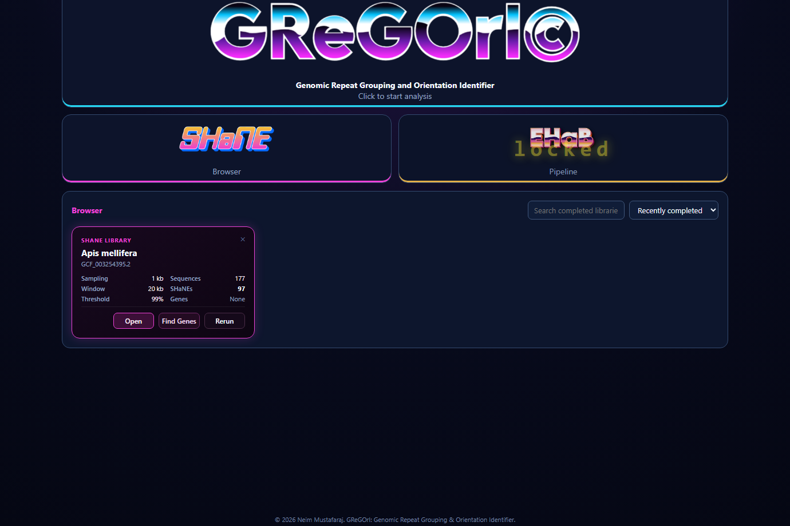
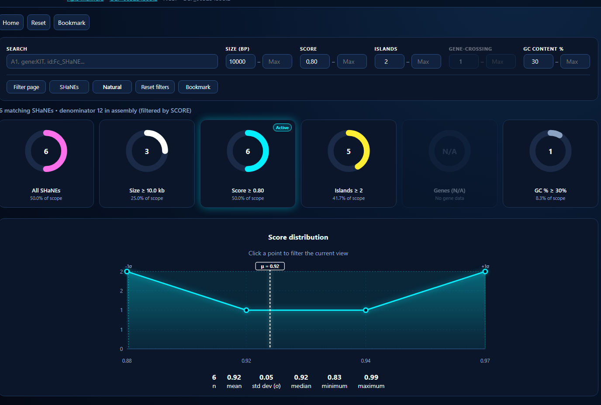
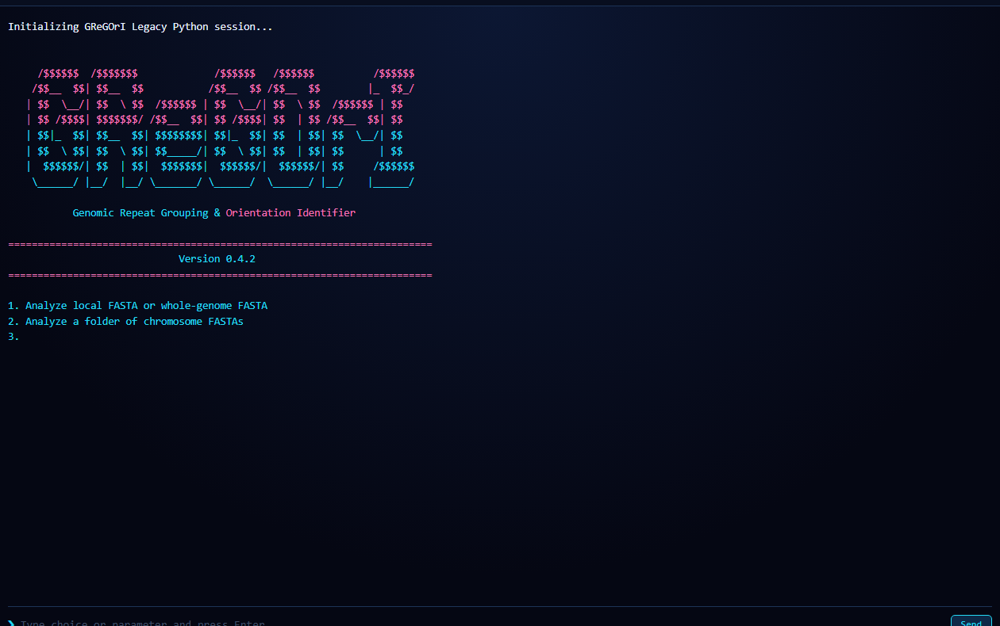

<p align="center">
  
</p>

<h1 align="center">GReGOrI: Genomic Repeat Grouping & Orientation Identifier</h1>

<p align="center">
  <b>A high-throughput scientific software suite for whole-genome discovery, dynamic programming duplex alignment, gene annotation superimposition, nearest-neighbor thermodynamic profiling, and interactive visualization of SHaNEs (Strict complementarity Hairpin-like Nested Elements).</b>
</p>

<p align="center">
  
  
  
  
</p>

---

## 🧬 What is a SHaNE?

A **Strict complementarity Hairpin-like Nested Element (SHaNE)** is an operational category of **multi-kilobase genomic architectures delimited by discrete islands of high, near-perfect Watson-Crick complementarity**.

* **Strict Complementarity**: Enforces rigorous Watson-Crick base-pairing across discrete island stems rather than general sequence similarity.
* **Nested Architecture**: Outer and inner complementary island stems flank and partition internal unbonded sequence intervals or localized branching hairpins.
* **Structural Realism**: Evaluates sequence-level inverted repeat topology without presuming an obligate constitutive folded state in chromatin.

---

## 🚀 Quick Start

### 1. Launch the Web Interface (1-Click)
Double-click [`Start_GReGOrI.bat`](Start_GReGOrI.bat) or run:
```bash
py launcher.py
```
This starts the local HTTP backend and opens the modern Palaces interactive web application at `http://127.0.0.1:8765/`.

### 2. Command Line Interface (`py -m gregori`)

```bash
# 1. Run whole-genome discovery analysis
py -m gregori analyze genome.fasta --species "Apis mellifera" --output ./results

# 2. Run analysis with Gene Map (GFF3/GTF) for automatic gene superimposition
py -m gregori analyze genome.fasta --species "Apis mellifera" --gff genes.gff3 --output ./results

# 3. Interactive color terminal inspection
py -m gregori inspect chromosome.fasta

# 4. Build standalone interactive SHaNE Browser HTML
py -m gregori browser results/central_library/GReGOrI_SHaNE_library.json --open

# 5. Correct/superimpose assembly-locked NCBI gene annotations
py -m gregori annotate ./results --patch-browser --open

# 6. Launch Web Interface on a custom port
py -m gregori gui --port 9000
```

---

## 🖥️ Modern Web Interface & Analysis Hub

<p align="center">
  
</p>

* **Unified Project Hub**: Manage custom FASTA runs, automated NCBI dataset searches, and chained parameter sweeps.
* **1-Click NCBI Datasets CLI**: Automatic platform binary installation (`datasets.exe`, `dataformat.exe`) directly from NCBI within the interface.
* **Real-time Lifecycle**: Pause, resume at chromosome checkpoints, restart, or re-run analyses seamlessly.

---

## 🔬 Interactive SHaNE Browser

<p align="center">
  
</p>

* **Telemetry Gauge Rings**: Instant distribution metrics for island count, gene crossings, scores, and GC content.
* **Adaptive Multi-Filter Navigation**: Click any gauge ring to dynamically filter the genome view by high-order structural properties.

<p align="center">
  
</p>

* **Quantile Distribution Overlays**: Continuous metrics partitioned via dynamic sample quantiles ($Q_0 \dots Q_k$) with arithmetic mean ($\mu$) centerlines and empirical standard deviation ($\mu \pm 1\sigma$, central 68.2%) dispersion bands.

---

## 🔍 Structural Duplex & Gene Overlap Inspector

<p align="center">
  
</p>

* **Secondary Structure Duplex Folds**: Base-pair ladder alignments with unified nearest-neighbor thermodynamic calculations ($\Delta G^\circ_{37}$, $T_m$).
* **Gene Annotation Overlays**: Bisect interval intersection with NCBI RefSeq / Ensembl gene models (exons, introns, CDS, UTRs) and direct NCBI Gene links.

---

## 📟 Interactive Web Terminal for GReGOrI (legacy version)

<p align="center">
  
</p>

* Run the original retro interactive console directly in your browser with full ANSI color output and automatic temporary sandbox isolation.

---

## 📦 Architecture & Module Structure

```
GReGOrI/
├── pyproject.toml              # PEP 517/621 packaging metadata (v1.0.0)
├── LICENSE                     # GNU General Public License v3.0 (GPLv3)
├── Start_GReGOrI.bat           # 1-click Windows GUI launcher
├── launcher.py                 # Root GUI launcher script
├── README.md                   # Software documentation
│
├── gregori/                    # Unified Core Python Package
│   ├── engine/                 # Core discovery, DP alignments, thermodynamics, plotting, terminal inspector
│   ├── annotation/             # GFF3/GTF parser, overlap engine, NCBI datasets integration
│   ├── browser/                # Standalone interactive SHaNE Browser builders & themes
│   ├── palaces/                # Enterprise Palaces architecture (Identity, Naming, Library)
│   ├── server/                 # Local HTTP server, project controller, native file dialogs
│   └── cli.py                  # Standardized multi-command CLI
│
├── frontend/                   # Web GUI Frontend Assets
│   ├── index.html              # Modern Palaces interactive web app
│   ├── legacy.html             # Retro dark interactive web console for Legacy GReGOrI
│   └── assets/                 # GReGOrI and SHaNE branding assets
│
├── docs/images/                # Documentation screenshots & banners
│
├── Legacy/                     # Original standalone terminal console script
│   └── GReGOrI (legacy version).py
│
├── bin/windows-x64/            # NCBI command-line utilities (datasets.exe, dataformat.exe)
└── tests/                      # Unified Test Suite (Engine, Browser, Annotation, Lifecycle, Smoke)
```

---

## 🧪 Running the Automated Test Suite

```bash
py -m unittest discover tests
```
Runs the comprehensive unit and integration test suite across the discovery engine, dynamic programming duplex alignment, gene overlap calculator, Palaces rich library validation, project lifecycle mutations, NCBI annotation pipelines, and end-to-end browser smoke tests.

---

## 📄 License

This project is licensed under the **GNU General Public License v3.0 (GPLv3)** — see the [`LICENSE`](LICENSE) file for details.

*For commercial licensing, enterprise integration, or proprietary dual-licensing inquiries, contact the author.*

---

## ✍️ Author & Citation

**Neim Mustafaraj**  
*GReGOrI: Genomic Repeat Grouping & Orientation Identifier* (2026).

